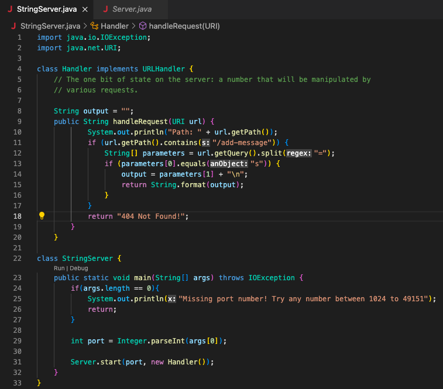
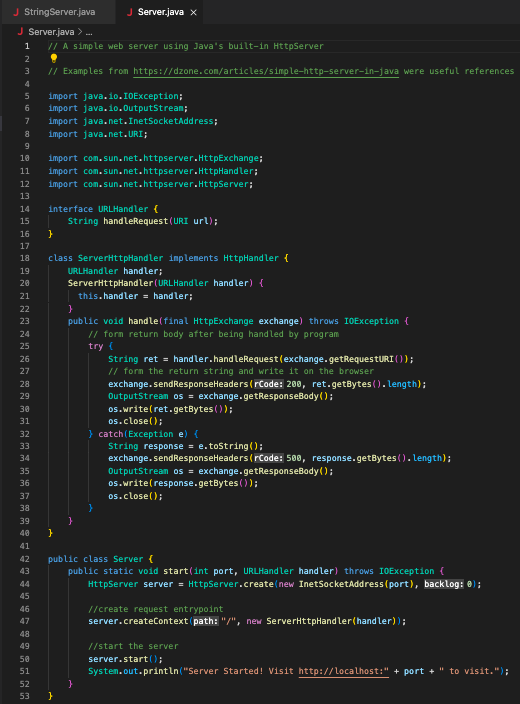
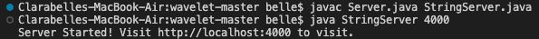

# Lab Report 2 - Servers and Bugs
## Experimenting with StringServer
Below is my code for StringServer as well as an untouched Server.java file from the Week 2 lab.

 

After running and compiling the files, it will tell us we can now visit the site!

Now that we have the link, we want to add a message to the site by using:
`/add-message?s=<string>`
  
* Note: <string> needs to be replaced with an actual string like: "hello" or "goodbye"
  
This means that the full link will be:
> http://localhost:4000/add-message?s=<string>
