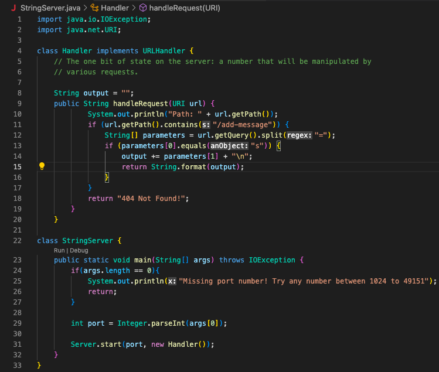
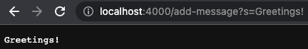
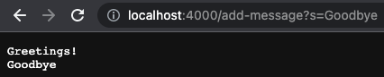
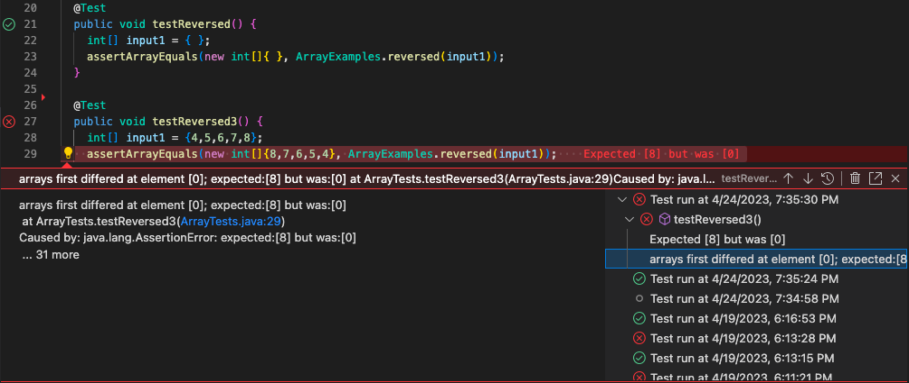

# Lab Report 2 - Servers and Bugs
## Experimenting with StringServer
Below is my code for StringServer as well as an untouched Server.java file from the Week 2 lab.

 

After running and compiling the files, it will tell us we can now visit the site!


Now that we have the link, we want to add a message to the site by using:

`/add-message?s=<string>`
  
* Note: The <, string, and, > in the URL needs to be replaced with an actual string like: "hello" or "goodbye"
  
This means that the full link will be:
> http://localhost:4000/add-message?s=<string>

* Note: In this case, the port number is 4000 so it should be replaced with a different number if a different one is used!
  
  
Here is an example of adding "Greetings!":


  
1. The methods that are called in my code are *handleRequest* in StringServer.java and within Server.java we have *start* and *handle*
2. The arguments for *handleRequest* is a **url** of type URI, for *start* we have **port** of type int and **handler** of type URLHandler, and for *handle* it takes in **exchange** of type HttpExchange
3. Within the Handler class of StringServer.java, the url is being read every time we change it, so when when a new string is inputted, the output is being changed to account for the new word. In this case, the server will only have "Greetings!" displayed
  
Here is an example of adding "Goodbye":
  
  

  
1. The same methods are being called in this example as well: *handleRequest*, *start*, and *handle*
2. The arguments are the same as above except **url** will have the value of the full link with "Goodbye" added at the end
3. As stated above, the Handler class has "output" as an instance variable to print all the strings entered. In this case, since "Greetings!" has been printed beforehand, the server will have "Greetings!" and "Goodbye" both printed on separate lines

## Lab 3 Bugs
One bug from lab 3 was the method that returns a new array with all elements of the input array in reverse order:
  
Failure inducing JUnit test:

```
@Test
  public void testReversed3() {
    int[] input1 = {4,5,6,7,8};
    assertArrayEquals(new int[]{8,7,6,5,4}, ArrayExamples.reversed(input1));
  }
```
  
Passing JUnit test:
  
```
@Test
  public void testReversed() {
    int[] input1 = { };
    assertArrayEquals(new int[]{ }, ArrayExamples.reversed(input1));
  }
```

Symptom:
  

  
  
Before change:
  
```
static int[] reversed(int[] arr) {
    int[] newArray = new int[arr.length];
    for(int i = 0; i < arr.length; i += 1) {
      arr[i] = newArray[arr.length - i - 1];
    }
    return arr;
  }
```

After change:
  
```
static int[] reversed(int[] arr) {
    int[] newArray = new int[arr.length];
    for(int i = 0; i < arr.length; i += 1) {
      newArray[i] = arr[arr.length - i - 1];
    }
    return newArray;
  }
```

The fix addresses the issue because before the change, newArray wasn't being changed and the arr array was being changed instead. Since we just initialized newArray, it wouldn't have anything in it thus all the values in arr would be changed to 0. All we needed to do was fix which array was being changed.
  
## Something I didn't know
One thing that I didn't know before was how to make a server and how to update what's displayed. Although most, if not all, the code written to create the site was already given to us, it was nice to be able to read and see what portion of the code does what. This made me ultimately realize that creating and changing what's on a server is mostly the same process. For example, we were first exposed to creating servers in Lab 2 which was used to display or increment a number while StringServer uses that foundation but only changes to one method, handleRequest, was necessary.
